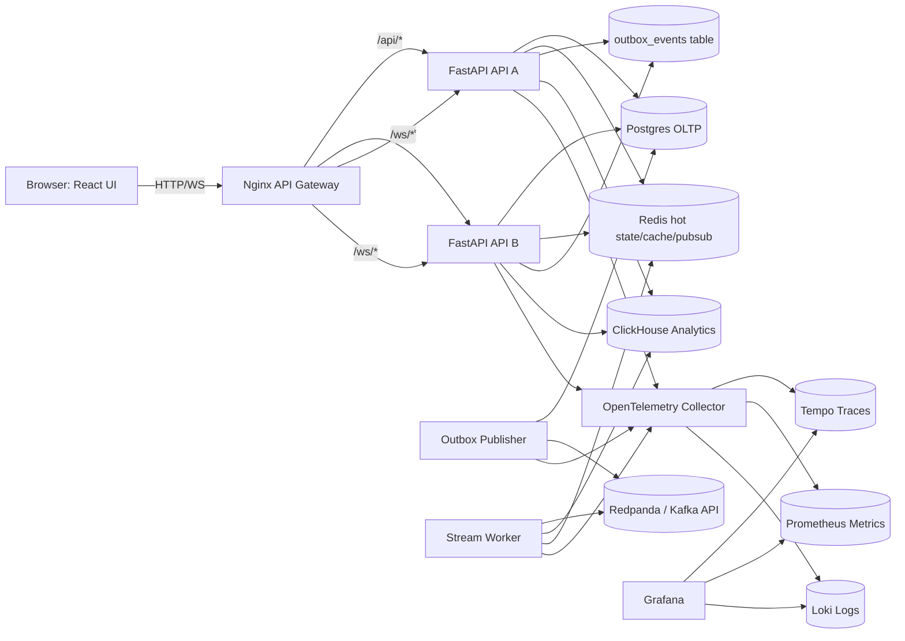

# System Architecture

## High-level architecture

## Service responsibilities

### Nginx gateway

- Single public entrypoint.
- Serves frontend static assets or proxies to frontend dev server.
- Routes `/api/*` to two FastAPI replicas.
- Routes `/ws/*` with WebSocket upgrade headers.
- Terminates TLS in production.
- Adds request IDs and forwards real client IP.

### FastAPI backend

- Owns REST API and WebSocket protocol.
- Validates auth and role permissions.
- Writes transactional state to Postgres.
- Uses Redis for hot room state, presence, leaderboards, pub/sub, cache, rate limiting, and idempotency.
- Inserts domain events into `outbox_events` in the same DB transaction as business writes.
- Exposes Prometheus metrics and OpenTelemetry traces.

### Postgres

System of record for durable domain state: users, quiz sets, rooms, participants, matches, questions, submissions, final results, moderation reports, audit logs, and outbox.

### Redis

Low-latency operational store:

- `room:{code}:state` hash for current room snapshot.
- `match:{match_id}:leaderboard` sorted set for live ranking.
- `room:{code}:presence` set with TTL heartbeats.
- `ws:room:{code}` pub/sub channel.
- `cache:quiz:{quiz_id}` and quiz-list cache.
- `idem:{request_id}` idempotency responses.
- `rate:{actor}:{action}` rate-limiter keys.

### Redpanda

Kafka-compatible broker for domain events. Topics:

- `livequiz.events.room`
- `livequiz.events.match`
- `livequiz.events.answer`
- `livequiz.events.moderation`
- `livequiz.events.dead_letter`

### Stream worker

- Consumes Redpanda events.
- Deduplicates by `event_id`.
- Writes event facts to ClickHouse.
- Updates post-match aggregates.
- Emits moderation side effects if needed.

### ClickHouse

Analytical store for high-volume event facts and aggregate queries:

- Answer distribution.
- Accuracy by question.
- Response-time percentiles.
- Room/match activity over time.
- Daily active users and match counts.

## DDIA-style design decisions

### Source of truth vs derived views

Postgres rows are the source of truth for transactional correctness. Redis and ClickHouse are derived views. If Redis state is lost, active room UX may degrade, but durable results remain in Postgres. If ClickHouse is lost, analytics can be rebuilt from Redpanda retention plus outbox/event archive.

### Avoid distributed transactions

The system does not attempt a distributed transaction across Postgres, Redis, Redpanda, and ClickHouse. Postgres commit is the authoritative boundary. Events are published using a transactional outbox and consumers are idempotent.

### At-least-once event processing

Events may be delivered more than once. Every event has a Snowflake `event_id`; ClickHouse and consumers dedupe by `event_id` or use replacing/unique logic. This is safer and easier to defend than claiming exactly-once across all services.

### Consistency model

- Strong consistency: user auth, quiz ownership, room capacity, one answer per player per question, final match results.
- Eventual consistency: analytics dashboards, daily aggregates, moderation statistics.
- Session-level real-time: WebSocket snapshots are versioned. Clients can request a REST snapshot if they reconnect.

### Time model

Server time is authoritative. Question start payload includes `started_at`, `deadline_at`, and `server_now`. The frontend displays a local countdown but server validates deadlines.

## Traffic flow examples

### Host starts match

1. Browser sends `POST /api/rooms/{room_code}/start`.
2. API checks host permission and room state in Postgres.
3. API creates `matches` and `match_questions`, changes room state, inserts `MatchStarted` outbox event.
4. API writes Redis room snapshot and publishes `match_started` to room pub/sub.
5. All connected WebSocket clients receive `match_started`.
6. Outbox publisher sends `MatchStarted` to Redpanda.
7. Stream worker writes event to ClickHouse.

### Player submits answer

1. Browser sends WS message `answer.submit` or REST `POST /api/matches/{match_id}/answers` with idempotency key.
2. API validates participant, current question, deadline, and uniqueness.
3. API writes `answer_submissions` row.
4. API calculates score and updates Redis sorted-set leaderboard.
5. API inserts `AnswerSubmitted` outbox event.
6. API returns `answer.accepted` and broadcasts leaderboard delta.
7. Stream worker writes answer event to ClickHouse for analytics.
