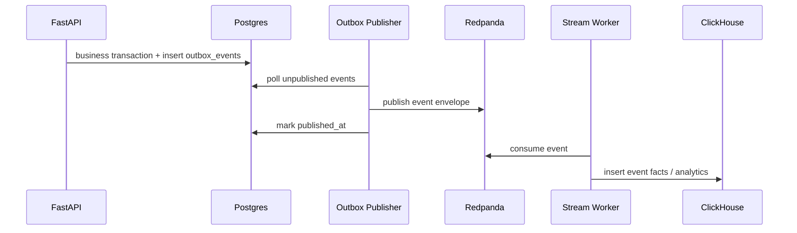
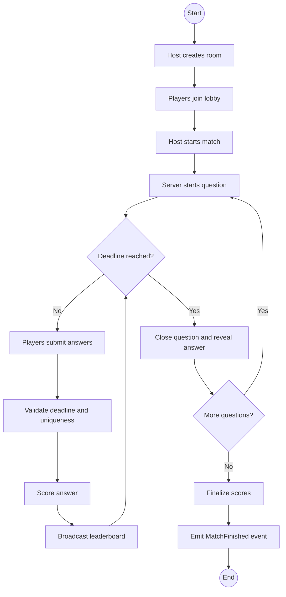
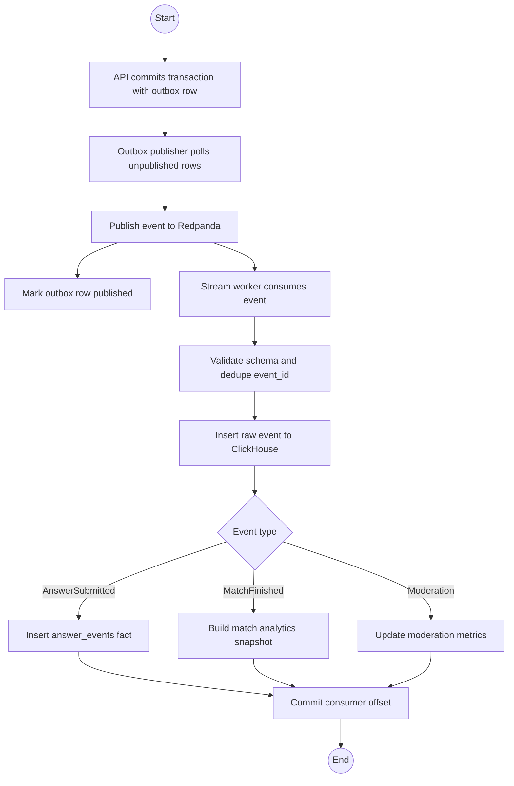
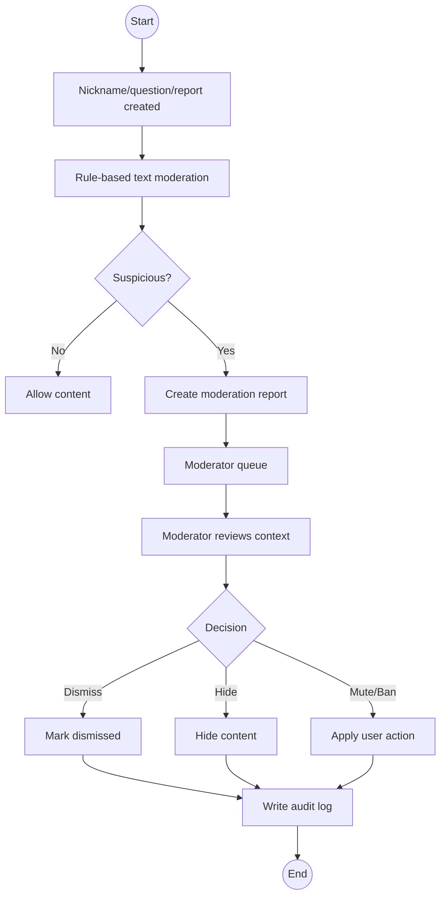

# Streaming Pipeline and BPMN

## Why a stream pipeline fits this project

Live quiz gameplay emits many small events: player joined, question started, answer submitted, leaderboard changed, match finished, report created. These events are valuable for post-match analytics, monitoring, and moderation. A broker decouples gameplay latency from analytical writes.

## Event flow



## Domain event envelope

```json
{
  "event_id": "738511559401627648",
  "event_type": "AnswerSubmitted",
  "aggregate_type": "match",
  "aggregate_id": "738511500123456789",
  "occurred_at": "2026-05-10T10:22:06.700Z",
  "producer": "livequiz-api",
  "schema_version": 1,
  "payload": {
    "room_id": "738511241389260800",
    "match_id": "738511500123456789",
    "match_question_id": "738511555098206208",
    "question_id": "738511553000000001",
    "participant_id": "738511300977209344",
    "is_correct": true,
    "score_awarded": 915,
    "response_time_ms": 1700
  }
}
```

## Topics

| Topic                         | Events | Consumer |
|-------------------------------|---|---|
| `livequiz.events.room`        | RoomCreated, PlayerJoined, PlayerLeft | stream-worker |
| `livequiz.events.match`       | MatchStarted, QuestionStarted, QuestionClosed, MatchFinished | stream-worker |
| `livequiz.events.answer`      | AnswerSubmitted | stream-worker |
| `livequiz.events.moderation`  | ContentReported, ContentFlagged, ModerationDecisionMade | stream-worker |
| `livequiz.events.dead_letter` | Failed events | manual/admin review |

## Outbox publisher algorithm

1. Select up to 100 unpublished `outbox_events` rows ordered by `occurred_at` with `FOR UPDATE SKIP LOCKED`.
2. Publish each event to Redpanda topic chosen by event type.
3. Mark `published_at = now()` after broker ack.
4. Increment `publish_attempts` on failure.
5. Move to dead-letter topic after max attempts or invalid schema.

## Stream worker algorithm

1. Consume events with consumer group `livequiz-analytics-v1`.
2. Validate envelope schema version.
3. Deduplicate using `event_id` cache and ClickHouse replacing table.
4. Insert raw event into `events_raw`.
5. For `AnswerSubmitted`, insert into `answer_events`.
6. For `MatchFinished`, compute final analytics snapshot and optional cache warming.
7. Commit broker offset only after successful processing.

## BPMN — Live match workflow



## BPMN — Event analytics pipeline



## BPMN — Moderation workflow



## Failure handling

- If Redpanda is temporarily down, outbox rows remain unpublished and publisher retries.
- If ClickHouse is down, stream worker stops committing offsets and resumes later.
- If an event is malformed, write to dead-letter topic and log trace ID.
- If duplicate event arrives, consumer ignores it by `event_id`.
